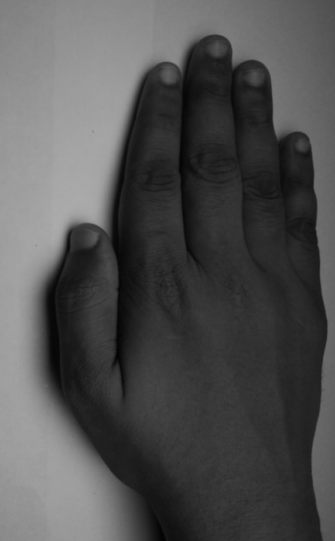
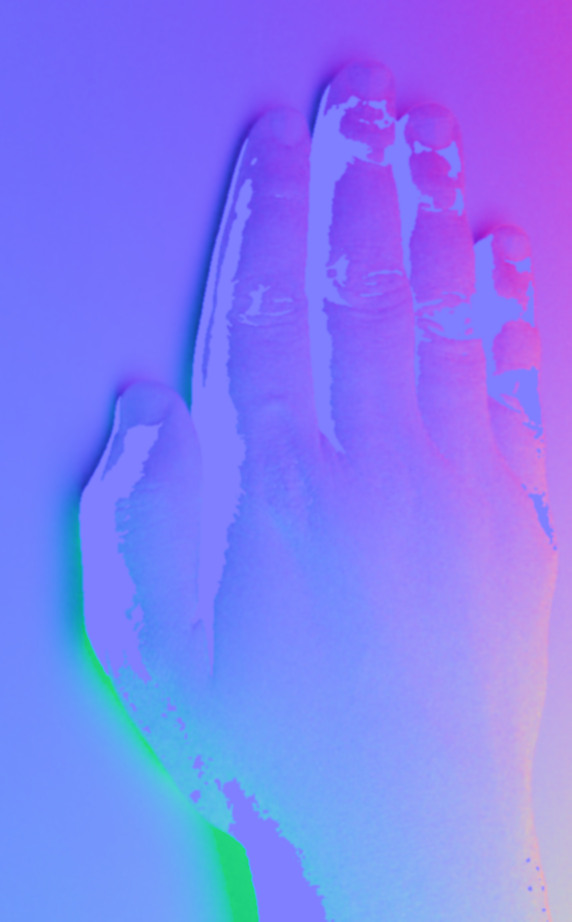
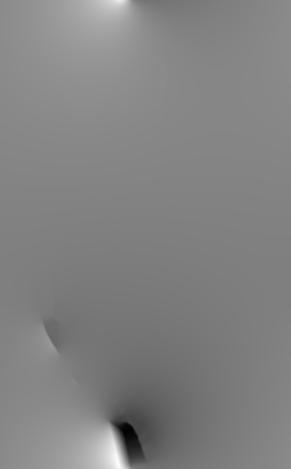

# SkinScan

**Gradient-based 3D skin lesion reconstruction** from smartphone images. Reconstructs depth and surface normals from four gradient-lit photos, exports metric meshes (mm), and provides interactive tools for lesion height, volume, and cross-section line profiles.

---

## Features

- **4-gradient photometric stereo** — Depth and normals from `grad_x_pos`, `grad_x_neg`, `grad_y_pos`, `grad_y_neg`
- **Physically meaningful gradients** — No arbitrary scaling; optional ambient subtraction and gamma correction
- **Metric output** — OBJ mesh and heights in **millimetres** after one-click calibration
- **Robust analysis** — Data-driven shadow/specular masking, RANSAC plane fitting, depth denoising
- **Interactive UI** — Point height, two-point height, ROI volume, and **dense line-profile graph** along any line on the albedo view

---

## Screenshots

| Albedo (clicking surface) | Normals map | Depth map | Mesh preview |
|---------------------------|-------------|-----------|--------------|
|  |  |  |  |

*After running the pipeline, use the albedo image to select points and draw lines; press `l` for a dense height profile along any line.*

---

## Prerequisites

- **Python 3.8+**
- **pip** (or conda)

---

## Installation

```bash
# Clone the repository
git clone https://github.com/YOUR_USERNAME/SkinScan.git
cd SkinScan

# Create and activate a virtual environment (recommended)
python -m venv venv
venv\Scripts\activate          # Windows
# source venv/bin/activate     # Linux / macOS

# Install dependencies
pip install -r requirements.txt

# Optional: for RANSAC plane fitting and robust measurements
pip install scikit-learn
```

---

## Quick Start

### 1. Add your gradient images

Place four gradient images in **`test_images/`**:

- `grad_x_pos.png` (or `.jpg` / `.jpeg`)
- `grad_x_neg.png`
- `grad_y_pos.png`
- `grad_y_neg.png`

### 2. Run the pipeline

```bash
python test_pipeline.py
python make_mesh_from_depth.py
```

Outputs appear in **`Results_test/`**: depth map, normals, albedo, raw depth/normals (`.npy`), OBJ mesh, and metrics.

### 3. (Optional) Calibrate to millimetres

Use an object of **known height** (e.g. 2 mm gauge block):

```bash
python calibrate_scale.py
```

Click **base** then **top** of the object, enter the height in mm. Scale is saved to `config.json`. Re-run `make_mesh_from_depth.py` to export the mesh in mm.

### 4. (Optional) Interactive measurement and line profile

```bash
python query_depth_point.py
```

- **`1`** — Albedo view (best for selecting points/lines)  
- **`l`** — Line profile: click two points → line is drawn and a **dense relative-height graph** opens  
- **`p`** — Point height  
- **`t`** — Two-point height  
- **`r`** / **`a`** — ROI polygon (volume, max/mean height)  
- **`b`** — Set base (white sheet = 0 height), **`0`** — Clear base  

---

## Full workflow (from scratch)

| Step | Command | Description |
|------|---------|-------------|
| 1 | `pip install -r requirements.txt` | Install dependencies |
| 2 | Put 4 gradient images in `test_images/` | See names above |
| 3 | `python correct_perspective.py` | *(Optional)* Fix perspective; click 4 corners of white sheet |
| 4 | `python test_pipeline.py` | Reconstruct depth & normals → `Results_test/` |
| 5 | `python make_mesh_from_depth.py` | Export OBJ mesh + metrics |
| 6 | `python calibrate_scale.py` | *(Optional)* Calibrate mm (base/top of known-height object) |
| 7 | `python make_mesh_from_depth.py` | Re-export mesh in mm after calibration |
| 8 | `python query_depth_point.py` | *(Optional)* Interactive height, volume, line profile |

See **[RUN_FROM_SCRATCH.md](RUN_FROM_SCRATCH.md)** for detailed commands and options.

---

## Project structure

```
SkinScan/
├── test_pipeline.py          # Main reconstruction (gradients → depth, normals)
├── make_mesh_from_depth.py   # Depth → OBJ mesh (metric if calibrated)
├── correct_perspective.py    # Optional perspective correction
├── calibrate_scale.py        # One-click mm calibration (base/top)
├── query_depth_point.py      # Interactive UI: height, volume, line profile
├── config_loader.py          # Load config.json (mm_per_unit, mm_per_pixel)
├── config.json               # Calibration and settings (created by calibrate_scale)
├── test_images/              # Input: grad_x_pos, grad_x_neg, grad_y_pos, grad_y_neg
├── test_images_warped/       # Optional: perspective-corrected images
├── Results_test/             # Outputs: depth, normals, albedo, mesh, metrics
├── docs/                     # HOW_3D_AND_HEIGHT_WORK.md, PHONE_SETUP.md, etc.
├── requirements.txt
├── RUN_FROM_SCRATCH.md
└── README.md
```

---

## Output files

| File | Description |
|------|-------------|
| `Results_test/depth_raw.npy` | Raw depth map (used by mesh export and query UI) |
| `Results_test/normals_raw.npy` | Surface normals |
| `Results_test/albedo_test.png` | Average of 4 gradients (natural-looking background for selection) |
| `Results_test/normals_test.png` | Normals visualisation |
| `Results_test/depth_test.png` | Depth visualisation |
| `Results_test/depth_mesh.obj` | 3D mesh (pixel or mm coordinates) |
| `Results_test/depth_mesh_preview.png` | Depth preview image |
| `Results_test/depth_metrics.txt` | Min/max/mean height, optional mm |

---

## Documentation

- **[HOW_3D_AND_HEIGHT_WORK.md](docs/HOW_3D_AND_HEIGHT_WORK.md)** — How gradients become depth and how height/calibration work  
- **[PHONE_SETUP.md](docs/PHONE_SETUP.md)** — Capturing gradient images with a phone  
- **[SETUP_AND_VIEWING.md](docs/SETUP_AND_VIEWING.md)** — Setup and viewing the mesh  

---

## Technical summary

- **Reconstruction:** I_const–normalised differentials → surface normals → slope field (p, q) → **Frankot–Chellappa** integration → depth.  
- **Improvements:** No gradient max scaling; optional ambient subtraction; gamma ≈ 2.2; data-driven shadow/specular thresholds; bilateral + median depth smoothing.  
- **Metric mesh:** When `config.json` has `mm_per_pixel` and `mm_per_unit`, mesh vertices are `x = col·mm_per_pixel`, `y = row·mm_per_pixel`, `z = depth·mm_per_unit`.  
- **Line profile:** Dense sampling (~4 samples/pixel) along a user-drawn line with sub-pixel interpolation; plot shows relative height vs distance (mm if calibrated).


